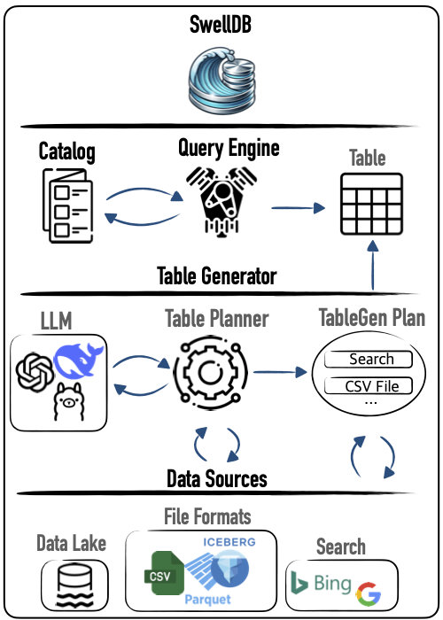

[](https://opensource.org/licenses/MIT)
[](https://github.com/SwellDB/SwellDB/actions/workflows/python-app.yml)

# SwellDB

**Query any data — from LLMs, databases, or the web — using just DataFrames or SQL**

---

## 🧠 Overview

**SwellDB** is a new kind of data system that enables SQL-based analytical querying over **dynamically generated tables**. These tables are synthesized in real-time from a combination of sources, including:

- Large Language Models (LLMs)
- Existing databases
- File formats (e.g., CSV, Parquet)
- Web search results

Unlike traditional systems operating under a closed-world assumption (queries only run on pre-loaded data), **SwellDB generates tables on-demand**, tailored to user-defined prompts and schemas.

This enables bridging structured SQL querying with the flexibility of unstructured data retrieval.

<div align="center">
  
  <p><em>Figure: SwellDB Architecture</em></p>
</div>

---

## 🚀 Key Features

- **🔄 Dynamic Table Generation**  
  Automatically synthesizes tables on-the-fly from queries and schema prompts — no need for preloaded data.

- **🌐 Multi-Source Integration**  
  Combines data from:
  - Large Language Models (LLMs)
  - Structured sources (e.g., CSV, SQL databases)
  - Unstructured sources (e.g., web pages, text files)
  - Web search results

- **🧠 LLM-Powered Reasoning**  
  Uses LLMs to:
  - Generate SQL queries over datasets  
  - Extract, augment, and synthesize missing information  
  - Transform unstructured text into structured tables

- **🧩 Modular & Extensible**  
  Easy to plug in new data sources via a clean Data Source API (structured + unstructured).

- **🧪 Fully SQL-Compatible**  
  Query generated tables with standard SQL — powered by [Apache DataFusion](https://datafusion.apache.org/).

- **🌍 Open-World Query Execution**  
  Go beyond what’s stored — SwellDB fetches or generates the missing pieces on demand.

- **⚡ Seamless Developer Experience**  
  Define tables declaratively using natural language and schema annotations. Then just write SQL.

---

## 🧪 Quick Example

```python
import os

from swelldb import SwellDB, OpenAILLM

swelldb: SwellDB = SwellDB(
    llm=OpenAILLM(api_key=os.environ["OPENAI_API_KEY"]), 
    serper_api_key=os.environ["SERPER_API_KEY"])

tbl = (
    swelldb.table_builder()
    .set_table_name("us_states")
    .set_content("A table that contains all the US states")
    .set_schema("state_name str, region str")
    .set_base_columns(["state_name"])
).build()

tbl.explain()

table = tbl.materialize()

table.to_pandas()[:5]
```
#### Output
```
    state_name     region
0      Alabama      South
1       Alaska       West
2      Arizona       West
3     Arkansas      South
4   California       West
```

### Querying with SQL
```python
import datafusion
import pyarrow as pa

sc = datafusion.SessionContext()
sc.register_dataset("us_states", pa.dataset.dataset(table))

print(sc.sql("SELECT * FROM us_states where region = 'South' LIMIT 5"))
print(sc.sql("SELECT COUNT(*), region FROM us_states GROUP BY region"))
```

#### Output
```
DataFrame()
+------------+--------+
| state_name | region |
+------------+--------+
| Alabama    | South  |
| Arkansas   | South  |
| Delaware   | South  |
| Florida    | South  |
| Georgia    | South  |
+------------+--------+
DataFrame()
+----------+-----------+
| count(*) | region    |
+----------+-----------+
| 12       | Midwest   |
| 9        | Northeast |
| 16       | South     |
| 13       | West      |
+----------+-----------+
```
